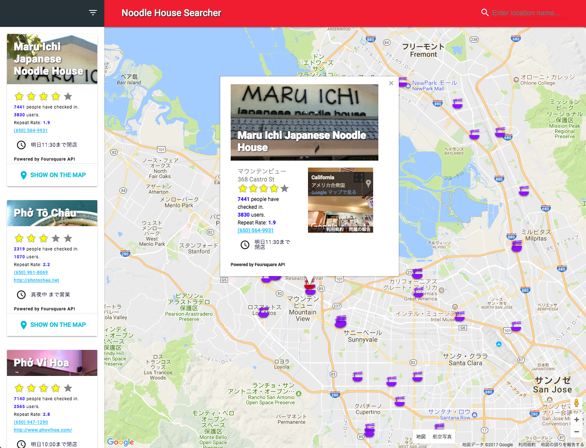
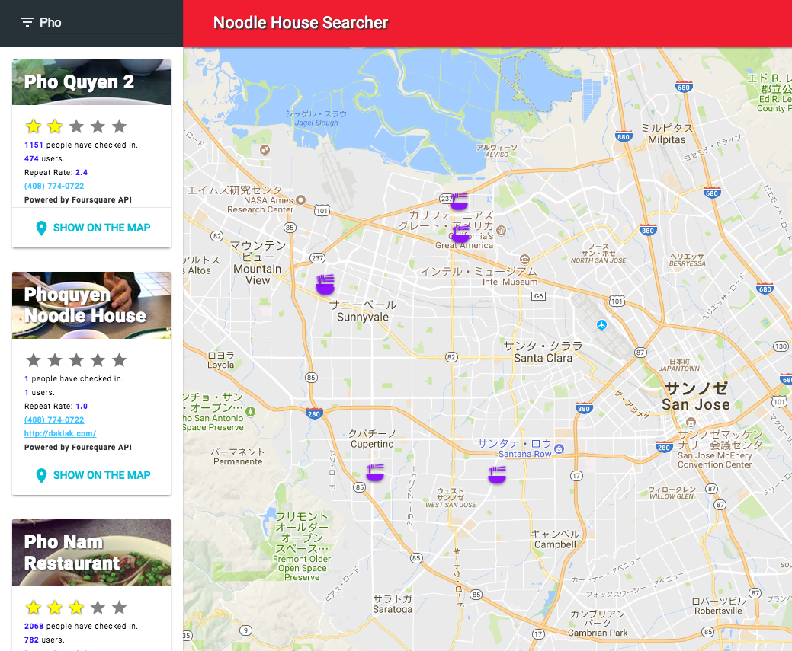
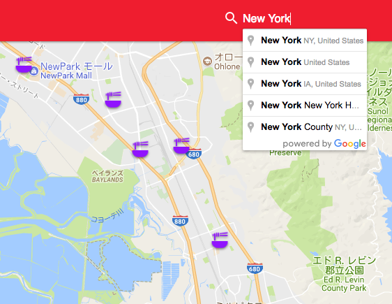
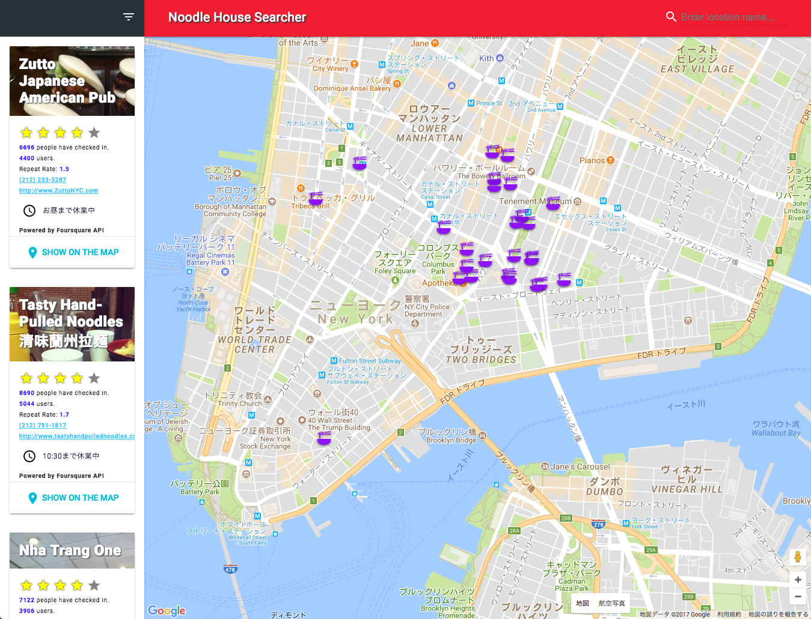

## Neighborhood map project
### Getting started

##### 1. Open your terminal and clone this repository to a directory you like:
```
$ git clone https://github.com/nekki-t/frontend-nanodegree-neighborhood-map.git
```
##### 2. Move to the directory which you cloned to:
```
e.g.
$ cd /{directory}/frontend-nanodegree-mobile-portfolio-master
```
##### 3. Install http-server:
```
$ npm install http-server -g
```
ref. https://github.com/indexzero/http-server
##### 4. Change your directory to src:
```
$cd /{directory}/src
```
##### 5. Run server:
```
$ http-server
```
##### 6. Visit url:
```
$ http://localhost:8080
```

## What you can
### 1. To know information only about Noodle Houses around the location you choose


### 2. To filter list by name


### 3. To change location with autocomplete support


### 4. To see noodle houses in different locations

